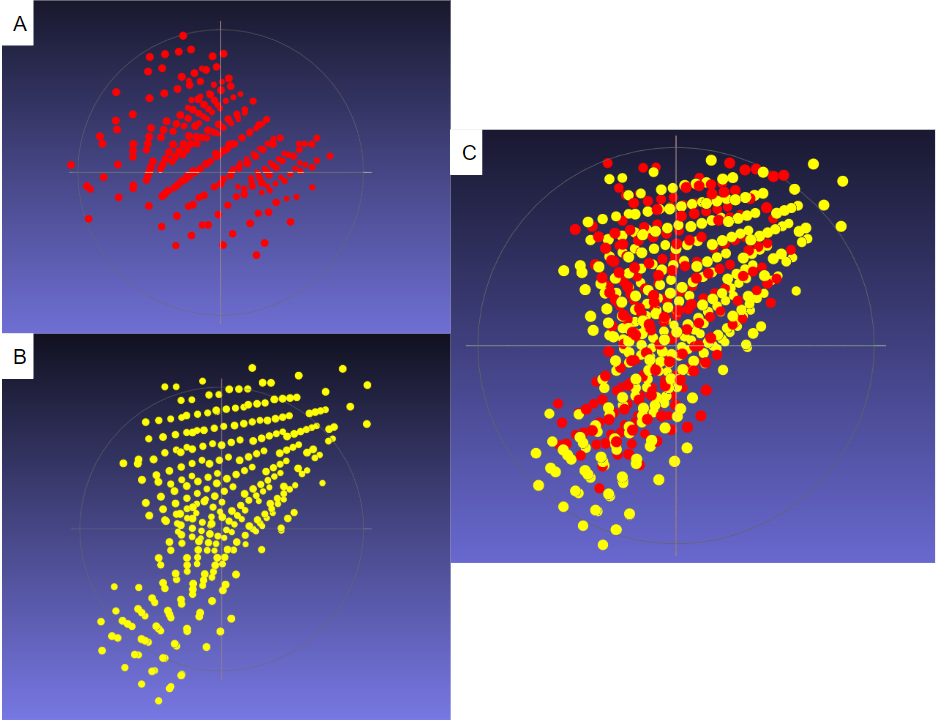
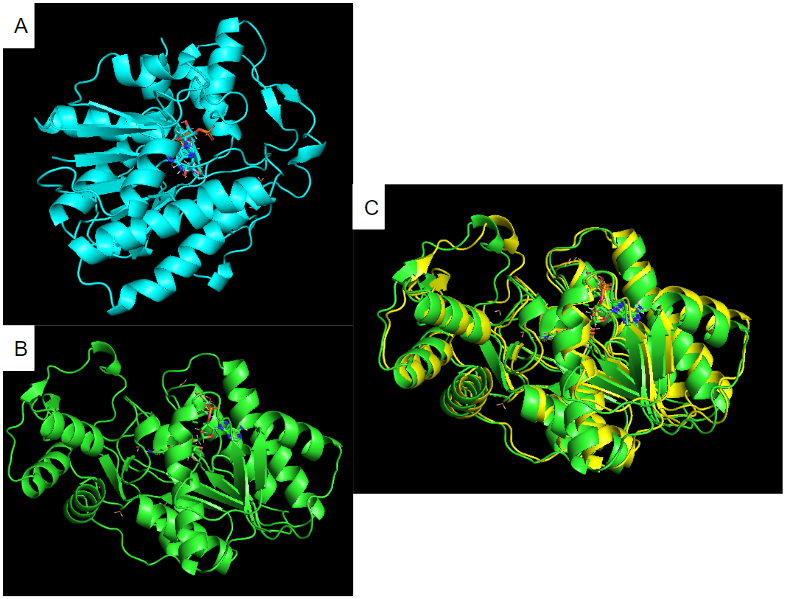

Adaptation of "Go-ICP: A Globally Optimal Solution to 3D ICP Point-Set Registration" by Yang et al. https://github.com/yangjiaolong/Go-ICP for protein cavities point clouds registration.

  
   

### Modifications to the original code
* jly_main.cpp: Normalization and centralization of point clouds, handle new config parameters and c-FPFH files, RMSD computation
* transformation: All functions of point cloud processing with normalization, centralization, scaling, application of transformation, RMSD computation
* jly_goicp: Modifications to structures to handle new parameters, functions and variables to add the new parameters in the ICP and BnB processes to adjust the error function
* jly_3ddt: Modifications on DT cells to know the points contained in each cell, and for the cells with no point in we search the closest occupied cell
* jly_icp3d: Addition of a variable to distinguish the ICP correspondences between an ICP which decreased the error and an ICP which not decreased

### Running 

* "./GoICP \<TARGET FILE\> \<SOURCE FILE\> \<NUMBER OF POINTS SOURCE\> \<CONFIG FILE\> \<OUTPUT FILE\> \<PAIR NUMBER\>"     
\<PAIR NUMBER\>: important if you use Go-ICP on a dataset, to iterate through it and keep the output files of all pairs

* bo1_GoICP.py: iterate through all pairs of a dataset. Make sure you have the folder "cavities" with the cavities point clouds at format .mol2 in it, and a file at format .tsv with all the pairs of the dataset and indicate it to Line6 of the file.

* Make sure you have the folders "cavities" with all the cavities point clouds at format .mol2, "chains" with the proteins files at format .mol2 and "ref_proteins" with the aligned proteins.
Moreover you must have the folders "cavitiesN", "cavitiesA" and "cavitiesR" to get the output of Go-ICP, with respectively the normalized point clouds, the points clouds after the transformation is applied, and the point clouds rescaled used for the RMSD computation. 

* A file named "ResultsRMSD.txt" is created, it contains the RMSD for each pair tested of the dataset.
